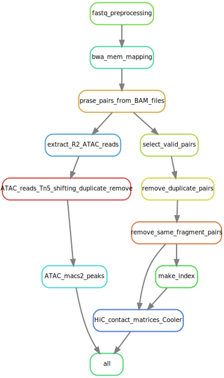

# HiCARTools
This is the HiCAR datasets processing  pipeline for Ren lab. The pipeline is still in the development stage, please let us know of any bugs and how to improve!

# work flow of the pipeline




# Dependencies 
* python3 
* BWA 
* samtools 
* pairstool
* pairix
* cooltools
* macs2
* snakemake (workflow management)

# Installation
See INSTALL

# How to run it.
1. Remember to install before running anything (see INSTALL).
2. Create your project folder. 
3. Inside your project folder, create a folder named `fastq`, and put all your .fastq files in that folder.  
...


# Output formats: 
##  Pairs: 
```
Columns: 
=======
1)Read Name 
2) R1 mapping Flag
3) R1 chr 
4) R1 position 
5) R1 fragment 
6) R2 mapping Flag
7) R2 chr 
8) R2 position 
9) R2 fragment 
10) R1 mapping quality
11) R2 mapping quality
```

# Contributing Authors

